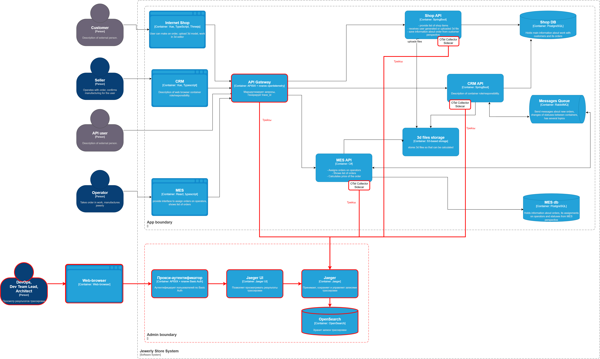
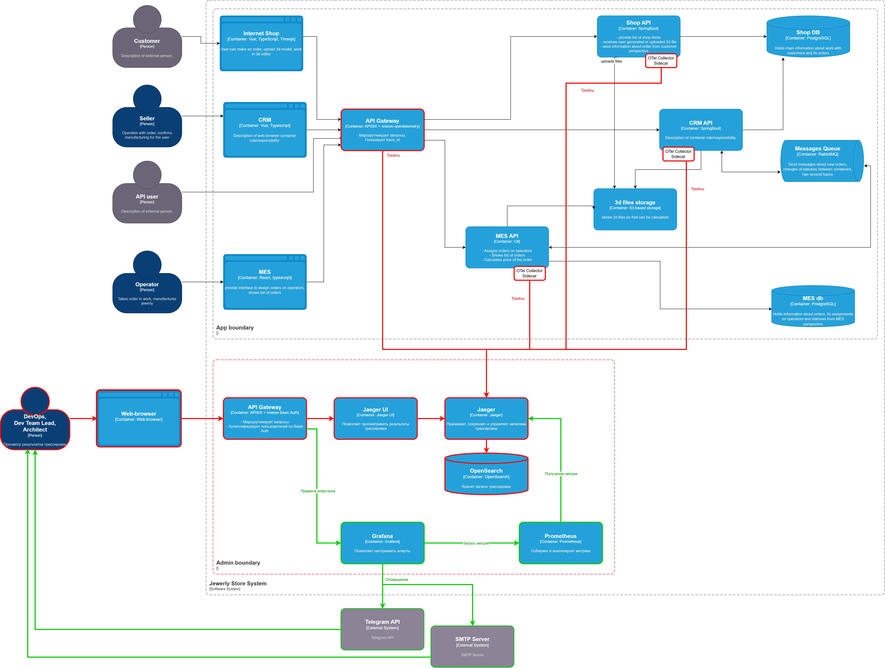

# Мотивация

- Внедрение трассировки - самое эффективное из имеющихся средство для обнаружения ошибки обработки заказов, которая приводит к большим финансовым потерям уже сегодня.
- Внедрение трассировки в дополнении с алертингом позволит быстрее обнаруживать новые ошибки. Т.к. система в ближайншее время будет значительно развиваться, а количество сервисов увеличиваться, вероятность возникновения ошибков будет расти экспоненциально. Без трассировки количество ошибок в какой то момент может заблокировать работу приложения в целом.
- Для трассировки существуют готовые инстументы анализа и сравнения. Они существенно упрощают и ускоряют поиск ошибок. Это значит, что проблемы пользователей будут решаться быстрее, а репутация компании будет расти.
- Трассировка позволит обнаруживать не только ошибки, но и проблемы с производительностью, что также положительно скажется на отношении клиентов и бизнес-партнёров.
- Перехватывать ошибки можно с помощью логов. Однако хранение логов всех вызовов с информацией, необходимой для анализа последовательности этих вызовов, будет обходиться очень дорого. Хранение данных трассировки будет обходиться дешевле. А логировать можно только данные об ошибках в дополнение к трассировке. 

# Системы, которые следует покрыть трейсингом

Согласно описанию, есть следующие кейсы при обработке заказа:

1. Создание заказа пользователем:
    - Shop API
    - Shop DB
    - 3D file storage

2. Создание заказа через API:
    - MES API
    - RabbitMQ
    - CRM API
    - MES DB

3. Вычисление цены заказа:
    - MES API
    - 3D file storage
    - MES DB

4. Обработка заказа:
    - MES API
    - RabbitMQ
    - CRM API
    - MES DB

**Таким образом в работе с заказом участвуют следующие сервисы на стороне бэкенда**:

- Shop API
- MES API
- CRM API

БД и Message Queue не взаимодействуют с Jaeger напрямую.

# Данные, которые должны попадать в трейсинг

Помимо стандартных trace_id, span_id и таймстемпов:

- **Название ноды** - чтобы понять в каком приложении произошло событие
- **Метод и эндпоинт** - чтобы понять тип операции
- **Order ID** - ID заказа
- **Order status** - Текущий статус заказа
- **User ID/API User ID** - ID покупателя или пользователя API
- **Operator ID** - ID оператора, в операциях идущих после назначения заказа

В случае ошибки, дополнительно сохраняются:

- **Входные данные (DTO)** или отдельные ключевые свойства, если DTO большое **с удалённой конфиденциальной информацией**.
- **Важные промежуточные результаты расчётов**, если они не содержатся в БД
- **Текст ошибки/исключения** и сообщения из вложенных исключений, если они есть
- **Stack trace**

# Предлагаемое решение

### Базовое решение

- Т.к. имеется несколько точек входа в приложение при работе с заказом, а также учитывая, что планируется внедрение автоматического масштабирования, рекомендуется развернуть API Gateway, например, APISIX с плагином opentelemetry. В нём будет генерироваться trace_id. Это позволит избежать дублирования кода на разных языках в нескольких сервисах.
- Добавить библиотеки/пакеты Open Telemetry SDK в выбранные сервисы и реализовать логику отправки трейсов в участки кода, которые занимаются обработкой и изменением статуса заказа.
- Добавить логику отправки трейсов в участки кода, которые только читают и возвращают данные заказа. Использовать выборочную трассировку 5% успешных операций для проверки статусов заказа. Всегда трассировать ошибки.
- Т.к. приложение высоконагруженное и уже имеются проблемы с производительностью, трейсы отправляются не напрямую в Jaeger, а через OTel Sidecar.
- Чтобы ограничить доступ к результатам трассировки используется выделенный доступ в ограниченную сетевую зону. Т.к. Jaeger не поддерживает авторизацию, для ограничения доступа можно использовать Nginx c Basic Auth или API Gateway, например, APISIX с плагином Basic Auth.
  Выбран APISIX с плагином Basic Auth, т.к.:
    - Проще настраивать логин и пароль
    - Проще настраивать маршрутизацию в Prometheus и Grafana для реализации алертинга
- В качестве хранилища трассировки выбрана OpenSearch. Он полностью поддерживается Yandex Cloud как Managed сервис.

[Диаграмма контейнеров с трассировкой в drawio](jewerly_c4_model_trace.drawio)

### Автоматический мониторинг процесса прохождения заказа

- Т.к. в рамках реализации мониторинга в систему будет интегрированы Prometheus и Grafana, настроить правила оповещений удобнее всего в них, например, в Grafana Alerting.
- Jaeger будет выступать источником метрик для Prometheus.

[Диаграмма контейнеров с трассировкой и автоматическим мониторингом в drawio](jewerly_c4_model_trace_monitor.drawio)

# Компромиссы

**Полноценная реализация всех предложенных изменений будет трудоёмкой, т.к.**:

- Потребуется интеграция новых сервисов трассировки, с которыми DevOps команда не работала ранее, а значит будет необходимо обучение.
- Компании придётся нанять ещё одного-двух DevOps инженеров. Сейчас в команде всего один DevOps инженер. На начальном этапе ему придётся выполнять много дополнительной работы, помимо основных обязанностей.
- Потребуется доработка существующих сервисов. Изменять придётся код, который уже потенциально содержит известные ошибки, что может привести к возникновению новых ошибок.
- Особенное опасение вызывает MES. Хотя команда имеет исходный код системы, он был написан не ими, а значит они плохо знакомы с внутренним устройством. Он написан на C#, а его знает только половина команды разработки, если учитывать тим-лида.

**Чтобы упростить развёртывание, предлагается**:

- На начальном этапе отказаться от Otel Collector Sidecar для каждого сервиса, особенно пока имеется только один инстанс сервиса:
    - Данные трассировки можно отправлять напрямую в Jagger. Однако, в случае падения Jagger, трейсы за этот период могуть быть потеряны.
    - Можно использовать общий OTel Collector для всех сервисов.
    - Данные трассировки можно отправлять в RabbitMQ. Тогда придётся реализовать отдельный сервис для вычитки этих данных из очереди сообщений.
- Включать трассировку сервисов последовательно. Начать с сервисов, которые написаны самими разработчиками для накопления опыта.

# Безопасность

- Данные трассировки не должны содержать персональную/конфиденциальную информацию. Данные этих категорий следует удалять при сохранении исходных данных (при ошибках), либо шифровать, если они всё же понадобятся.
- Данные трассировки следует отнести к внутренним данным, т.к. по ним можно понять внутреннюю архитектуру приложения. Поэтому их следует защищать от злоумышленников.
- Доступ к данным трассировки разрешён только ограниченному кругу лиц: DevOps инженер, ведущий разработчик и архитектор, т.к. они имеют представление об общей архитектуре.
- Доступ должен быть запрещён отдельным разработчикам сервисов, менеджменту и другим сотрудникам по принципу наименьших привилегий. Они не обладают достаточными знаниями о системе в целом и данная информация не будет им полезна в работе.
- Отдельные разработчики могут временно привлекаться к расследованию ошибок, если проблема будет выявлена в их зоне ответственности. Для этого следует формировать временные ссылки (secure link) или временно заводить пользователей с настройкой автоматического удаления.
