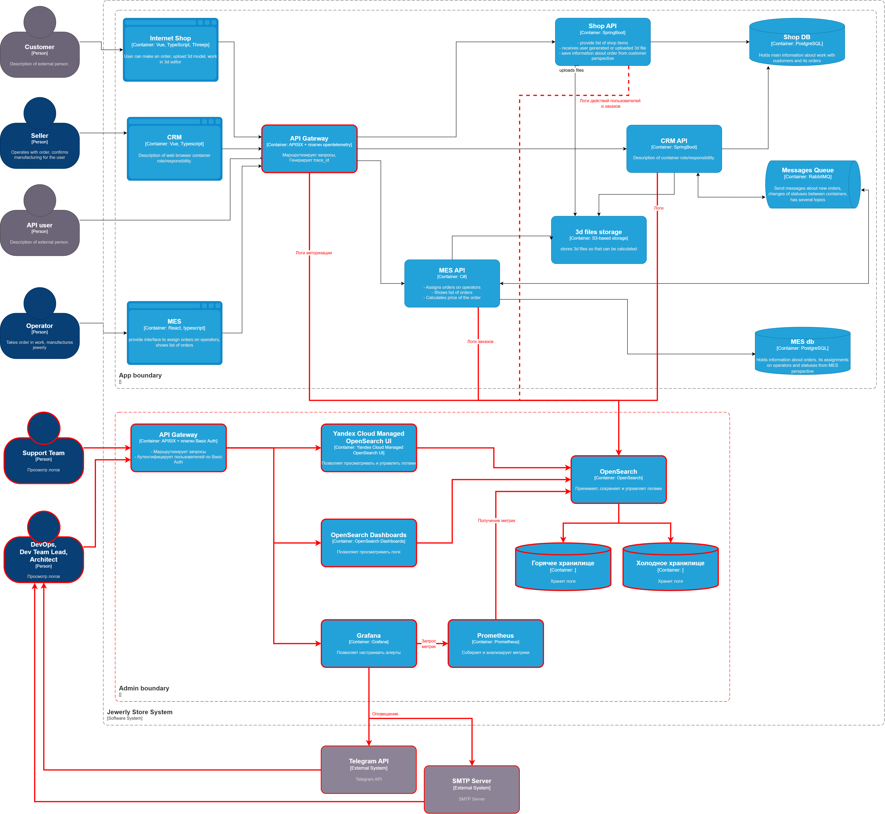

# Мотивация

### Достоинства

- Логи позволяют собирать данные, которые системы мониторинга и алертинга будут использовать для контроля доступа к приложению и выявлению подозрительной активности.
- Логи существенно упрощают и ускоряют поиск ошибок, предоставляя информацию о месте и причине возникновения, и сообщая контекстную информацию из кода, которую будет сложно или невозможно получить после инцидента, например, падения приложения.
- Системы анализа логов позволяют настроить алертинг в случае обнаружения критических ошибок, а значит снижается риск, что эти ситуации останутся незамеченными или команда среагирует на них слишком поздно.
- Быстрое определение и исправление ошибок положительно скажется на отношении пользователей к компании. Это может привести к увеличению числа клиентов за счёт "сарафанного радио" и, соответственно, увеличению прибыли.
- Логи позволяют собирать информацию о действиях пользователей. На основе полученной статистики, руководство сможет сформировать объективное представление о популярных и менее важных функциях приложения и сосредоточить усилия по разработке в правильном направлении, не распыляя их. Например, на разработку новой дорогостоящей функциональности с высоким шансом популярности и быстрой отдачей по затратам. Или оптимизацию Usability.
- Например, на основе статистики исполнения заказов можно формировать и поддерживать таймауты на выполнение каждого этапа работы с зазаком. После чего, опрашивать контрагентов (операторов, службу доставки) об актуальном статусе исполнения и заблоговременно оповещать пользователя.
- На основе данных из логов, менеджмент и маркетологи смогут более точно выделить категории и предпочтения пользователей и формировать целевые рекламные кампании и персональные предложения.
- Информация из логов обычно бывает крайне полезна при расследовании причин возникновения ошибок, обнаруженных с помощью трассировки. Без неё эффективность трассировки снижается.

### Недостатки

- Хранение и анализ логов может быть дорогостоящим, однако логи поддаются настройке без перезапуска сервисов, что позволит регулировать уровень детализации и соответственно регулировать занимаемое ими место и зартаты.

### Приоритетные сервисы

Трейсинг и логирование необходимо настроить в первую очередь для высоконагруженных систем и участков кода. В текущих условиях, необходимо принять во внимание наличие известных ошибок с заказами. Поэтому, в первую очередь, трассировку и логирование необходимо настроить для:

- MES API - этот сервис выполняет сразу несколько функций по работе с заказами и выполняет тяжелые расчёты. Риск обнаружения ошибки в нём очень велик.
- CRM API - данный сервис выполняет контроль и изменение статуса заказов и активно взаимодействует с и есть высокий риск наличия ошибок именно в нём.
- Особенно уделить внимание взаимодействию с RabbitMQ. Т.к. он не может выполнять логирование самостоятельно, потребуется логировать взаимодействия в CRM API и MES API.

Причие сервисы:

- Shop API - данный сервис выполняет инициализацию заказа. Факт наличия ошибки без деталей, можно увидеть опосредованно по работе CRM и MES. Кроме того, судя по всему, проблемы с заказом начинаются уже после подтверждения, а за это отвечают CRM и MES. Поэтому, его логирование можно производить позже.

CRM API и Shop API работают с единой БД. Это может быть точкой отказа.

### Служба поддержки

Само по себе логирование не решит ни технические, ни бизнес проблемы. Для того чтобы логи стали полезны, необходимо интегрировать в приложение систему анализа логов. Она, по заданным правилам, или с помощью предобученных AI/ML агентов будет на лету просматривать события, происходящие в системе, формировать статистику и выявлять проблемы. С помощью таких систем, служба поддержки сможет:

- Получать информацио о зафиксированных фактах проблем у пользователей.
- Сверять их словесные показания с фактическими действиями, зафиксированными в логах для контроля.
- Получать дополнительную информацию, не видимую пользователям, и консультировать их.

Как результат:

- Уменьшится количество рутины при решении типовых проблем пользователей.
- Служба поддержки сможет сама решать часть проблем, не привлекая к решению команду разработки.
- Сократится общее время решения проблемы и специалист поддержки сможет помочь большему числу пользователей.
- Служба поддержки сможет агрументированно отстаивать позицию компании в случае конфликтов.

# Данные логов

Во всех логах фиксируется:

- **Время возникновения**
- **Уровень лога**
- **Имя/ID компонента**
- **Версия микросервиса/сборки** (опционально)
- **ID реплики/пода** (опционально, на будущее)

- **Trace ID** (при наличии) для связывания логов с трассировкой

В случае ошибки, дополнительно сохраняются:

- **Текст ошибки/исключения** и сообщения из вложенных исключений, если они есть
- **Stack trace**
- **Важные исходные данные**, в обезличенном виде, конфиденциальная информация удаляется
- **Важные промежуточные результаты расчётов**, если их невозможно восстановить

Пример логов с уровнем INFO:

| Операция/событие            | Специфические атрибуты                                                                |
| --------------------------- | ------------------------------------------------------------------------------------- |
| **Действия клиента**        |                                                                                       |
| Аутентификация              | ID клиента, Зашифрованный IP адрес клиента, Результат                                 |
| Выход из системы            | ID клиента                                                                            |
| Изменение личных данных     | ID клиента, Тип данных                                                                |
| Изменение корзины           | ID клиента, Действие, ID товара                                                       |
| Удаление аккаунта           | ID клиента, Причина удаления                                                          |
|                             |                                                                                       |
| **Обработка заказа**        |                                                                                       |
| Создание заказа             | ID клиента, ID заказа                                                                 |
| Назначение 3D-файла заказу  | ID заказа, ID 3D-файла, Формат 3D-файла, Размер 3D-файла                              |
| Расчет цены заказа          | ID заказа, Цена, Кол-во полигонов, Длительность расчёта                               |
| Назначение заказа оператору | ID заказа, ID оператора                                                               |
| Оплата заказа               | ID клиента, ID заказа, Способ оплаты, Результат, Зашифрованный ответ платежного шлюза |
| Изменение статуса заказа    | ID заказа, Текущий статус заказа, Новый статус заказа                                 |
|                             |                                                                                       |

Другие уровни логов:

- Данные об ошибках, в особенности уровня FATAL, необходимо собирать, по возможности, со всех сервисов. То есть уровень логов по умолчанию для большинства сервисов - ERROR.
- В случае обнаружения повторяющихся ошибок в сервисе и невозможности определения причины ошибки, можно временно увеличить уровень детализации логов этого сервиса или отдельного компонента до INFO/DEBUG.
- В процессе разработки допустим уровень TRACE в средах DEV и TEST, чтобы не упустить важные шаги и состояния алгоритмов для последующего анализа ошибок.

# Предлагаемое решение

Опираясь на таблицу в последнем разделе, оптимальным вариантом является OpenSearch:

- OpenSource позволит сэкономить средства на дорогостоящих лицензиях.
- Поддерживается нативно в Yandex Cloud как Managed сервис - уменьшается необходимость в первоначальной настройке, а команда получит множество возможностей из коробки.
- У команды не было опыта работы с такими системами - большое комьюнити и документация позволят быстрее освоиться с системой.
- Отсутствует Vendor Lock - данные хранятся в стандартной форме, похожей на ELK, поэтому после набора опыта можно быдет проще мигрировать на другую систему.
- Поддерживает большое количество плагинов.

Для обеспечения безопасности следует использовать плагин opensearch-security и/или встроенные средства Yandex Cloud.

Для реализации мониторинга и алертинга на основе данных из логов будут использоваться Prometheus и Grafana.

Служба поддержки может первое время использовать OpenSearch Dashboards. Если функционала будет не хватать, можно будет приобрести или разработать специализированное решение.

### Политики безопасности

- Данные логов не должны содержать персональную/конфиденциальную информацию. Данные этих категорий следует удалять при сохранении исходных данных (например, оставлять только последние 4 цифры карты оплаты), либо шифровать, если они всё же понадобятся.
- Данные логов следует отнести к внутренним данным, т.к. по ним можно понять уязвимости в приложении и понять организацию архитектуры и кода. Поэтому их следует защищать от злоумышленников.
- Доступ к "сырым" логам разрешён только ограниченному кругу лиц: DevOps инженер, ведущий разработчик и архитектор.
- Доступ к "сырым" логам должен быть запрещён отдельным разработчикам сервисов, менеджменту и другим сотрудникам по принципу наименьших привилегий. Они не обладают достаточными знаниями о системе в целом и данная информация не будет им полезна в работе.
- Отдельные разработчики могут временно привлекаться к расследованию ошибок, если проблема будет выявлена в их зоне ответственности. Для этого следует заводить временных пользователей с ограниченным доступом.
- Ограниченный доступ к логам должны иметь сотрудники службы поддержки, для работы с клиентами.

### Примерный расчёт объема логов

Считаем, что время исполнения заказа составляет в среднем 1 месяц, поэтому все значения приведены к месяцу.

1. **Общее**:
    - Типовая запись лога с минимальным числом полей составляет порядка **150 символов**:

        ```
        {"time":"2026-09-18T08:00:00Z","level":"INFO","logger":"price-calculator","pod":"mes-uewiweufhiwfgef-yrtr","ver":"1.2.3.4567","traceId":"abcdef12"}
        ```

    - В среднем будет добавляться 3-4 дополнительных поля, длиной порядка **150 символов**:

        ```
        "clientId":12345,"orderId":67890,"curStatus":"PRICE_CALCULATED","newStatus":"MANUFACTURING_APPROVED"
        ```

    - Итого, по нижней оценке, одна запись INFO лога будет составлять **300 символов** или **300 байт**.

2. **Заказы**:
    - На логирование каждого заказа потребуется минимум 10 записей об изменении статуса, значит потребуется 10 * 300 => 3000 байт.
    - Каждое изменение статуса будет сопровождаться 5-10 сервисными записями (например, получение события в CRM от MES через RabbitMQ), что добавит ещё 5 * 10 * 300 => 15000 байт.
    - Итого, на 1 заказ порядка 18000 байт.
    - Предположим, что в начале работ по внедрению логирования, в среднем в месяц делается порядка 1000 заказов. Т.к. каждый месяц кол-во заказов увеличивается на 100, значит к концу года будет 2100 своих заказов в месяц. Суммарно к концу года потребуется порядка 2100 * 18000 => 37_800_000 байт/месяц => **40 Мб/месяц** для своих заказов.
    - Также нужно учесть заказы от других продавцов ювелирных изделий, но т.к. конкретные цифры не указаны, предположим, что суммарное число заказов равно 10000. Значит к концу года потребуется порядка 10000 * 18000 => 180_600_000 байт/месяц => **180 Мб/месяц** для всех заказов.
    - Расчёт умышленно сделан без суммы прогрессии, из-за ротации логов.

3. **Действия пользователя**:
    - Каждое событие аутентификации пользователя логируется для контроля безопасности.
    - Предположим что, для выполнения заказа, пользователь выполняет 100 действий в системе. Сюда входит поиск товаров, формирование 3D модели товара в конструкторе, заполнение корзины, оформление заказа.
    - Каждое действие будет сопровождаться 5 сервисными записями.
    - Получается, что для хранения логов пользователя при оформлении заказа потребуется 100 * 5 * 300 => 150_000 байт/месяц. Их придётся хранить, пока заказ не завершен, для расследования инцидентов.
    - Предположим, что после оформления заказа, пользователь будет проверять статус заказа 2 раза в день.
    - Предположим, что время исполнения заказа составляет в среднем 1 месяц.
    - Получается, что для хранения логов проверки статуса потребуется 2 * 5 * 300 * 30 => 90_000 байт/месяц.
    - Итого, 150_000 + 90_000 => 240_000 байт/месяц на одного пользователя.
    - Итого, 2100 * 240_000 => 504_000_000 байт/месяц => **500 Мб/месяц** к концу года.
    - Расчёт умышленно сделан без суммы прогрессии, из-за ротации логов.

4. **Итого**:
    - Суммарно к концу года, потребуется хранить 180 + 500 => **700 Мб/месяц**.
    - Эти числа нужно умножить в 1,5-2 раза, т.к. на пике заказы и события с предыдущего месяца будут соседствовать с заказами текущего месяца при том, что основная часть событий происходит именно при подготовке заказа.
    - Также, результат нужно умножить в 3-4 раза, т.к. расчёты велись по нижней границе, без учёта записей об ошибках и других типов логов. 
    - Итого, 700 * 2 * 4 => 5600 Мб/месяц => 6 Гб/месяц в конце года.
    - Т.к. согласно заданию некоторые заказы могут задерживаться на несколько месяцев и их потребуется хранить дольше, поэтому потребуется порядка 6 * 2 => **12 Гб**

ИТОГО, на ближайший год потребуется горячее хранилище порядка **12 Гб** для хранения логов связанных с заказами, при принятых условностях. Однако, из-за роста числа заказов, объйм хранилища требуется постоянно пересматривать. 

### Ротация логов

Для управлением ротацией логов будет использоваться встроенный инструмент ISM (Index State Management):

- Т.к. базовый интервал хранения логов - 1 месяц, для логов уровня INFO смена индекса будет производиться каждый месяц. После того как все заказы в индексе берейдут в завершенное состояние, он будет перемещаться в холодное хранилище.
- В холодном хранилище данные должны храниться пока не исчечёт гарантия на изделие. Затем индекс будет удаляться.
- Логи уровня ERROR хранятся год.

Потребуется несколько индексов:

- Данные по заказам.
- Данные активности пользователей.
- Ошибки.

### Диаграмма

[Диграмма контейнеров с логами в drawio](jewerly_c4_model_logs.drawio)



# Мероприятия для превращения системы сбора логов в систему анализа логов

Т.к. в рамках мониторинга, в приложение будет добавляться Prometheus и Grafana, оптимальным будет передача метрик из системы сбора логов в Prometheus, настройка правил и алертинга в Grafana.

- Ситуации типа "было четыре записи о создании заказов и за секунду их стало 10 000" будут определяться системой мониторинга на основании стандартных метрик APi Gateway, для этого не нужен анализ логов.

Нужно ли настроить какой-то алертинг?
Нужно ли искать аномалии? Например, было четыре записи о создании заказов и за секунду их стало 10 000. Возможно, происходит DDoS-атака конкурентами.

# Критерии для выбора технологии

Все представленные системы сбора и анализа логов являются развитыми конкурентами и предоставляют похожий функционал разной стетени проработанности. Быстрое сопоставление данных из статей не позволяет, в отсутствии реального опыта, составить адекватную картину, т.к. отличия кроются в деталях, а в статьях пишут одно и тоже. В итоге, консиллиум из 3 LLM и меня позволил сформировать такой результат :)

| Критерий                        | ELK                                                                                                                                                      | OpenSearch                                                                                    | Splunk                                                                                                                | Dynatrace                                                                                       | Datadog                                                                                                  | SigNoz                                                                                                    |
| ------------------------------- | -------------------------------------------------------------------------------------------------------------------------------------------------------- | --------------------------------------------------------------------------------------------- | --------------------------------------------------------------------------------------------------------------------- | ----------------------------------------------------------------------------------------------- | -------------------------------------------------------------------------------------------------------- | --------------------------------------------------------------------------------------------------------- |
| Лицензия                        | Тройная: Elastic License 2.0 / SSPL / AGPLv3 (с 2024)                                                                                                    | Apache License 2.0                                                                            | Проприетарная (в составе Cisco)                                                                                       | Проприетарная                                                                                   | Проприетарная                                                                                            | MIT License (для ядра open-source) / Проприетарная Enterprise                                             |
| Бесплатная версия               | Базовая под AGPLv3/SSPL (без продвинутого ML, CCR и Alerting)                                                                                            | Полная версия со всеми enterprise-фичами бесплатно (Security, ISM, Alerting, ML Commons)      | До 500 МБ/день (без кластеризации и алертов)                                                                          | Только trial                                                                                    | Только trial                                                                                             | Полноценная Self-Hosted Community версия без лимитов на объём данных, хосты и пользователей               |
| Платные функции                 | Продвинутый RBAC, ML, CCR (Cross-Cluster Replication), SIEM-модули, SSO/SAML, FIPS, Case Management, AI Assistant                                        | Отсутствуют, все opensource. Платно только Managed сервис (AWS) и саппорт от вендоров         | Enterprise Security (ES), ITSI, SOAR, SVC пакеты                                                                      | Платформа коммерческая, тарификация по подписке DPS, Davis AI, App Security, Business Analytics | Каждый модуль оплачивается отдельно (APM, Profiling, ASM, Serverless, Log Management, SIEM)              | SSO/SAML, advanced RBAC, смарт-ассистент Noz AI, комплаенс-отчеты (SOC2, HIPAA)                           |
| Стоимость                       | Средняя/Высокая (Лицензии + Инфраструктура)                                                                                                              | Низкая/Средняя: только инфраструктура + эксплуатация (самый дешевый на больших объемах логов) | Очень высокая (In-gest pricing или SVC - вычислительные мощности)                                                     | Высокая (Модель Dynatrace Platform Subscription - DPS)                                          | Высокая и трудно прогнозируемая: оплата за хост, за ingest, за retention/index                           | Низкая/Средняя (в self-hosted только железо + поддержка ClickHouse), в Cloud от $49/мес                   |
| Сложность внедрения             | Высокая (требует экспертизы по тюнингу JVM и шардам)                                                                                                     | Средняя/Высокая (администрирование кластеров, индексов)                                       | Высокая (Архитектура Forwarder-Indexer-Search Head + SPL)                                                             | Низкая (OneAgent делает авто-обнаружение всей топологии, Dynatrace Operator)                    | Низкая (Быстрое развертывание агентов, SaaS-модель, сотни интеграций из коробки)                         | Низкая на старте (Docker/Helm), Средняя на проде (требуется DevOps-экспертиза в тюнинге ClickHouse)       |
| Потребление ресурсов            | Среднее/Высокое (требует тюнинга JVM heap и памяти для инф-ры)                                                                                           | Среднее/Высокое (аналогично ELK, тяжелое хранение, сегментная репликация)                     | Высокое (требует выделенных мощных Indexer и Search Head серверов)                                                    | Низкое/Среднее (основная нагрузка в облаке вендора, на хостах легкий OneAgent)                  | Низкое (сбор через легковесный Datadog Agent, обработка на стороне SaaS)                                 | Среднее (значительно экономнее к RAM и диску, чем ELK/Splunk, за счет колоночного хранения)               |
| Развёртывание On-premise        | Self-managed, Elastic Cloud Enterprise (ECE)                                                                                                             | Self-managed, AWS Managed OpenSearch                                                          | Splunk Enterprise (On-prem)                                                                                           | Dynatrace Managed (Гибрид, данные локально, control plane в облаке)                             | Отсутствует (Строго SaaS, есть Private Locations для синтетики)                                          | Self-managed (Bare-metal / VM / Kubernetes), SigNoz Cloud, опция BYOC (Bring Your Own Cloud)              |
| Производительность              | Высокая (быстрый полнотекстовый поиск, технологии RAG/векторный поиск)                                                                                   | Высокая (оптимизирована под терабайтные потоки данных, сегментная репликация)                 | Высокая на чтение (благодаря индексации данных при записи)                                                            | Очень высокая (анализ триллионов событий в реальном времени без сэмплинга)                      | Высокая (высокая скорость индексации потоковых логов и метрик)                                           | Очень высокая на чтение и агрегацию больших объемов (благодаря движку ClickHouse)                         |
| Масштабирование                 | Горизонтальное (шардирование, ILM-политики (rollover, shrink, freeze))                                                                                   | Горизонтальное (Index State Management (аналог ILM), холодные зоны хранения в S3)             | Горизонтальное (через SmartStore и кластеризацию Indexer)                                                             | в SaaS, retention до 10 лет в Grail                                                             | Автоматическое (масштабируется под любые пиковые нагрузки силами SaaS), retention, Rehydration из архива | Горизонтальное (компоненты Query, Frontend и Otel-Collector скейлятся независимо от кластера ClickHouse)  |
| Поддержка Kubernetes            | Elastic Agent, ECK (Elastic Cloud on Kubernetes)                                                                                                         | Fluent Bit / Data Prepper, базовые Helm-чарты                                                 | Splunk Connect for Kubernetes, OpenTelemetry Operator                                                                 | Продвинутая (Dynatrace Operator, eBPF, авто-трейсинг)                                           | Эталонная (Datadog Cluster Agent, eBPF, интеграция с Control Plane)                                      | Нативная через официальный Helm-чарт, автоматический сбор k8s-метаданных через DaemonSet                  |
| Безопасность                    | Базовая бесплатно; RBAC/SSO/шифрование/аудит — в платных подписках                                                                                       | Встроенная бесплатно (полный RBAC, TLS, аудит, интеграция с Active Directory)                 | Высший уровень (Сертификация FedRAMP, строгий комплаенс, SIEM-аналитика), HIPAA, PCI DSS                              | Встроенная безопасность приложений (Application Security), SOC2, ISO 27001, HIPAA, AppSec       | Встроенный Cloud Security Management, SOC2, ISO 27001, GDPR, Cloud SIEM                                  | SOC2 Type II, HIPAA (в Cloud). В On-premise — базовый TLS, платные модули SAML и RBAC                     |
| AI модули                       | Elastic AI Assistant (RAG), Anomaly Detection, интеграция с LLM, векторный поиск                                                                         | ML Commons, K-NN поиск, интеграция с внешними LLM , Anomaly Detection                         | Splunk Machine Learning Toolkit (MLTK) + Splunk AI Assistant (генеративный ИИ для написания SPL)                      | Davis AI (Каузальный ИИ $ +$ Predictive ИИ $ +$ Davis Co-pilot)                                 | Watchdog (поиск аномалий), Bits AI (генеративный SRE-помощник)                                           | Noz AI (генеративный ИИ на базе LLM для написания ClickHouse SQL-запросов и разбора инцидентов)           |
| Зависимость от вендора          | Средняя (перенос данных на OpenSearch возможен через Snapshot API, но платные фичи уникальны)                                                            | Низкая (полный open source, экспорт в S3, данные легко мигрировать)                           | Очень высокая (проприетарный язык запросов SPL, дорогая миграция)                                                     | Высокая (привязка к проприетарной технологии OneAgent и Davis AI)                               | Высокая (сложно уйти из-за проприетарных агентов и кастомных дашбордов)                                  | Нулевая (полный стандарт OpenTelemetry, данные хранятся в стандартных таблицах ClickHouse)                |
| Инструменты сбора               | Elastic Agent (Fleet), Logstash, Beats (устаревают)                                                                                                      | OpenSearch Agent, Data Prepper, Fluent Bit / Fluentd                                          | Universal/Heavy Forwarder, OpenTelemetry Collector                                                                    | OneAgent (полностью автоматический инжект кода)                                                 | Datadog Agent, Vector (Observability Pipelines)                                                          | OpenTelemetry Collector (родной), обратная совместимость с FluentBit, Logstash, Prometheus                |
| Сложность кастомизации          | Средняя (Kibana дашборды, язык запросов KQL/ES DSL)                                                                                                      | Средняя (OpenSearch Dashboards, PPL и SQL языки запросов)                                     | Высокая (требует глубокого изучения языка Splunk SPL)                                                                 | Низкая (большинство дашбордов строятся автоматически «из коробки»)                              | Низкая/Средняя (удобный UI-конструктор дашбордов с Drag-and-Drop)                                        | Низкая/Средняя (мощный графический ClickHouse Query Builder + кастомные дашборды)                         |
| Язык запросов                   | KQL (Kibana Query Language), ES DSL, ESQL                                                                                                                | DQL, PPL (Piped Processing Language), SQL                                                     | SPL (Search Processing Language)                                                                                      | DQL (Dynatrace Query Language)                                                                  | Datadog Query Syntax, PromQL (частично)                                                                  | ClickHouse SQL, PromQL (для метрик), визуальный конструктор кликами (Query Builder v5)                    |
| Архитектура хранения            | Data Tiers (Hot/Warm/Cold/Frozen), Searchable Snapshots (Платная фича)                                                                                   | Сегментная репликация, Remote-backed storage (S3) для холодного слоя                          | SmartStore (отделение вычислений от хранения, S3)                                                                     | Grail (Сверхбыстрое озеро данных без индексов)                                                  | Husky (Собственная колоночная in-memory база данных)                                                     | Колоночная БД ClickHouse для всех трех сигналов, поддержка S3/GCS для холодного слоя данных               |
| Поддержка OpenTelemetry         | Нативный OTel Collector -> Elastic, Fleet поддерживает                                                                                                   | Нативный: Data Prepper принимает OTel                                                         | Полная поддержка: OTel Collector как основной Forwarder                                                               | OneAgent + OTel, Davis транслирует спэны                                                        | Datadog Agent + OTel Collector (dual ship)                                                               | 100% нативная (вся архитектура и схема данных спроектированы строго вокруг спецификации OTel)             |
| Популярность                    | Высокая (мировой стандарт де-факто для On-premise логирования)                                                                                           | Высокая (особенно в AWS-экосистеме и импортозамещении)                                        | Высокая (лидер в Enterprise SIEM и SecOps)                                                                            | Высокая (лидер в APM для крупного Enterprise)                                                   | Очень высокая (стандарт для Cloud-native и стартапов)                                                    | Очень высокая и быстрорастущая в Open Source сообществе (главная современная альтернатива Datadog)        |
| Область применения              | Разработчики, DevOps, централизованный сбор логов (Центры мониторинга)                                                                                   | Облачные инфраструктуры, SaaS-сервисы, замена ELK в Enterprise, Гос-сектор                    | Крупный Enterprise, Банки, SOC/SIEM (Информационная безопасность)                                                     | Большие корпорации с монолитной или сложной микросервисной архитектурой                         | Cloud-native компании, мультиоблачные среды (AWS/Azure/GCP)                                              | Микросервисные архитектуры, Cloud-Native и K8s инфраструктура, современные бэкенд-платформы               |
| Ключевой сценарий использования | Нужен self-hosted с векторным поиском/RAG и возможностью платить за поддержку. AGPLv3 требует открыть исходники сервиса, если предоставляется как сервис | Требуется отсутствие лицензионных платежей, AWS-экосистема или импортозамещение.              | Строится SOC/SIEM в банке/телекоме/бигтехе и нужна сертифицированная безопасность. Модель SVC вместо простого ingest. | Нужен Full-Stack APM без настройки — закрывает метрики, трейсы, логи и security одним агентом.  | Cloud-native стартап/продукт на AWS/GCP/Azure и важна скорость time-to-value.                            | Нужен полноценный и дешевый APM (метрики+логи+трейсы) на базе OpenTelemetry без привязки к SaaS-вендорам. |
