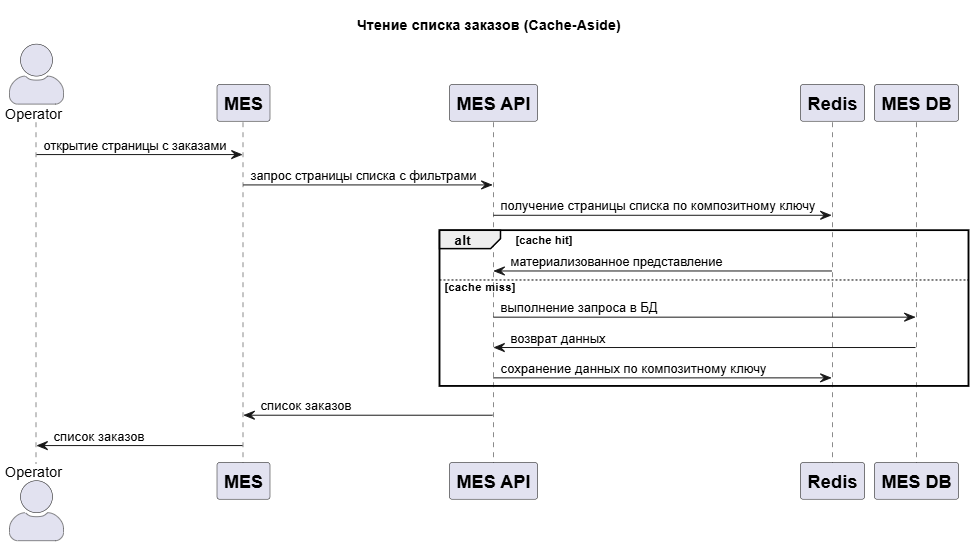
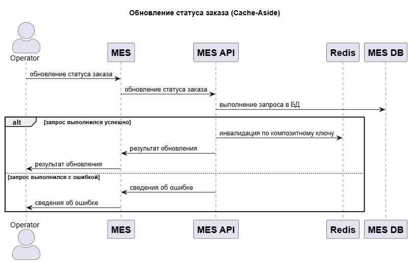

# Мотивация

В приложении есть известные проблемы с производительностью - "Участились жалобы от операторов: когда они заходят на первую страницу MES, система долго прогружается. На первой странице отображается список заказов в работе по статусам — это дашборд с фильтром.".

Исходные данные:

- Операторам важно видеть самые новые заказы.
- Фильтр по статусам и пагинация не помогли в решении.
- Имеет место большое число заказов и высокая конкуренция за заказы среди операторов.
- Операторы выполняют регулярное обновление списка и фильтрацию, значит кол-во чтений превосходит число записей.

Операторы работают напрямую с MES. При этом будут задействованы сервисы - MES, MES API, MES DB. Другие сервисы в изменении статуса заказов участия не принимают. Это означает что, скорее всего, проблема производительности локализована на уровне этих систем.

Т.к. фильтр по статусам и пагинация не помогли в решении, то можно сделать предварительный вывод о том что причиной является долгое исполнение большого числа сложных запросов в БД. Необходимо учитывать что MES API и БД являются самыми высоконагруженными сервисами и сними работают не только операторы, но и пользователи.

В качестве одного из решений, можно использовать кеширование. Оно позволит:

- Ускорить выполнение запросов на чтение списка заказов за счёт сохранения наиболее частых типов запросов в оперативной памяти.
- Устранить необходимость в обращении к базе данных MES DB и выполнении сложных запросов.

# Предлагаемое решение

### Предварительные проверки

- Проверить наличие индекса в БД по статусу и дате изменения заказов. Отсутствие индекса сильно сказывается на производительности.
- Проверить SQL запросы. Возможно они не оптимальны.
- Продумать возможность масштабирования и репликации MES DB. Это позволит организовать чтение одновременно из нескольких реплик.

### HTTP кеширование

HTTP кеширование не поможет в решении проблемы, т.к. список заказов обновляется часто, а операторам важно видеть актуальные статусы заказов. Необходимо убедиться что HTTP кеширование запрещено в заголовках страницы.

### Серверное кеширование

Количество запросов на чтение судя по всему кратно преобладает над количеством записей в отношении заказов:

- Если предположить, что в системе обрабатывается 10000 заказов в месяц, с учетом заказов партнёров, и принять, что для каждого заказа выполняется порядка 10 операций изменения состояния, включая создание, то получится, что в среднем в системе происходит 10000 \* 10 / 30 / 24 / 60 => **3 изменения в минуту**. Даже учитывая суточные пики и увеличив значение в 10 раз получается всего **1 изменение в 2 секунды**.
- С другой стороны, из-за высокой конкуренции, операторы постоянно обновляют список заказов, применяя к ним сортировку и фильтры. Это приводит к выполнению большого числа запросов на выборку данных.

Предлагается использовать серверное кеширование. Оно позволит:

- Сохранять в оперативной памяти результаты наиболее частых запросов.
- Уменьшить необходимость в обращении к БД.
- Уменьшить необходимость выполнения одинаковых запросов.

Кеширование будет реализовано на уровне сервиса **MES API**.

В качестве возможных стратегий подойдут:

- Cache-aside:
    - Плюсы:
        - Простота реализации.
        - Результат будет храниться в готовом виде, т.е. модель может отличаться от БД.
    - Минусы:
        - Кэш может быть не согласован с БД в течение короткого промежутка времени, пока выполняется программная инвалидация.
        - Возможна повышенная нагрузка на БД из-за параллельных запросов после промаха кэша от разных операторов.

- Write-Through (в сочетании с Read-Through):
    - Плюсы:
        - Высокая производительность чтения, кроме первого запроса.
        - Данные между кешем и базой данных всегда будут синхронизированы.
    - Минусы:
        - Высокий latency на запись из-за необходимости обновления как кэша, так и БД. Однако, если приведённые ранее расчеты верны, это не должно являться проблемой.
        - Модель данных в кэше будет соответствовать БД.

Паттерн Refresh-ahead не подойдет потому, что не получится определить адекватный TTL для данных в кэше. Изменение статусов заказа происходит непредсказуемо.

Паттерн Write-Behind не подойдет потому, что служит для ускорения записей за счёт батчинга. В данном случае, необходимо оптимизировать чтение. Кроме того, PostgreSQL его нативно не поддерживает, а для программной реализации потребуется обеспечивать консистентность данных, до записи в БД, что является трудновыполнимой задачей.

**Стратегия кеширования**

В итоге, в качестве основной стратегии кеширования выбран **Cache-Aside**. Он позволит хранить в кеше готовые ответы для фронтенда. Это позволит уменьшить число одновременных одинаковых запросов к БД. Минус стратегии в том, что будет небольшое окно в момент сброса кеша, когда другие операторы могут успеть получить старые данные, однако т.к. инвалидация производится программно, это окно будет стремиться к нулю.

В качестве кеша предлагается использовать Redis. Он позволит хранить материализованные представления, готовые для отдачи во фронтенд.

Для уменьшения нагрузки на БД при промахе кеша, можно использовать легковесную локальную блокировку, пока инстанс один. Когда инстансов MES API станет несколько можно будет использовать распределённую блокировку через Redis.

Стратегия Write-Through также подойдет, но т.к. модель данных в кеше совпадает с моделью в БД, для эффективности может потребоваться хранить большое число записей. В этой стратегии обновление кеша может выполняться менее эффективно. Если в кеше будут храниться все данные активных заказов, тогда сортировку и фильтрацию придется делать в MES API, который и так сильно загружен.

**Инвалидация кэша**

В качестве стратегии инвалидации используется программная инвалидация по ключу. Она выполняется при изменении добавлении и изменении статуса и других атрибутов заказа.

Также, для записей следует устанавливать TTL:

- Для дополнительной защиты согласованности кеша, на случай если основная стратегия инвалидации завершится с ошибкой.
- Для удаления из дорогого кеша записей, которые никем не используются.

# Диаграмма последовательности

[Чтение списка заказов в plant uml](order-list-request-sequence.puml)

[Обновление статуса заказа в plant uml](order-update-sequence.puml)

